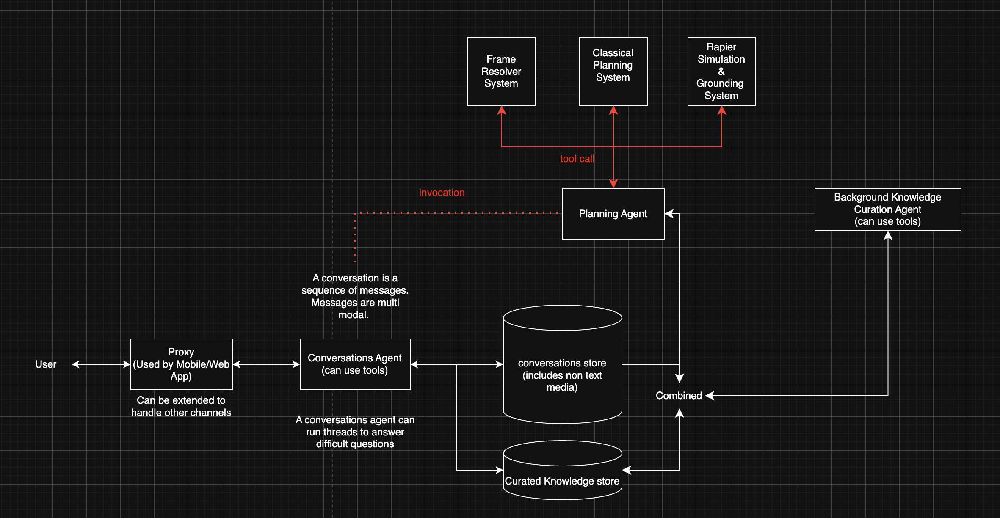

# Architecture

## Overview

A conversation is a sequence of multi-modal messages. The user reaches the
system through the proxy. The conversations agent owns the primary dialogue
loop, can use tools, and persists work into the conversations store. A
separate planning agent can be invoked for planning-heavy tasks and can call
specialized planning and simulation systems. Background knowledge curation
reads from the operational stores and writes curated knowledge back for later
use.



## Components

**Proxy** — Entry point for the mobile and web app. It can be extended later
to handle additional channels.

**Conversations Agent** — Primary user-facing agent. It handles the live
conversation, can use tools, and can run threads to answer difficult
questions.

**Planning Agent** — Specialized agent for planning-oriented reasoning. It is
invoked from the conversations flow when a task needs structured planning or
simulation.

**Frame Resolver System** — Resolves user intent into grounded planning frames
that the planning agent can work with.

**Classical Planning System** — Produces structured plans from grounded inputs
and constraints.

**Rapier Simulation & Grounding System** — Runs simulation-oriented grounding
checks for plans.

**Conversations Store** — Operational store for conversation history and
non-text media.

**Curated Knowledge Store** — Derived knowledge store used for retrieval and
curation workflows.

**Background Knowledge Curation Agent** — Asynchronous agent that can use
tools, reads from the stores, and updates curated knowledge.

## Flow

1. The user interacts with the system through the proxy.
2. The proxy forwards the request to the conversations agent.
3. The conversations agent reads from and writes to the conversations store.
4. When a task requires planning, the conversations agent invokes the
   planning agent.
5. The planning agent can call the frame resolver system, the classical
   planning system, and the Rapier-based simulation and grounding system.
6. Conversation data and curated knowledge are combined as inputs to the
   background knowledge curation agent.
7. The background knowledge curation agent updates the curated knowledge
   store and can use tools during that process.

## Package Direction

Current package structure follows the same split shown in the diagram:

```text
packages/
  agents/                    # conv-agent, kb-curate-agent, planning-agent
  domain/
    entities/                # shared domain entities
    contracts/               # shared domain contracts
  message-proxy/             # channel-facing proxy layer
  web/                       # web client
  mobile/                    # mobile client
```

The planning internals currently live inside `packages/agents` under
`planning-agent` and are organized into `frame`, `plan`, and `sim`.

## Notes

- The proxy and the agents run as separate services.
- The conversations store is the operational source for live assistant state.
- The curated knowledge store is a derived store, not the primary operational
  record.
- The planning agent is a specialized capability, not a replacement for the
  conversations agent.
