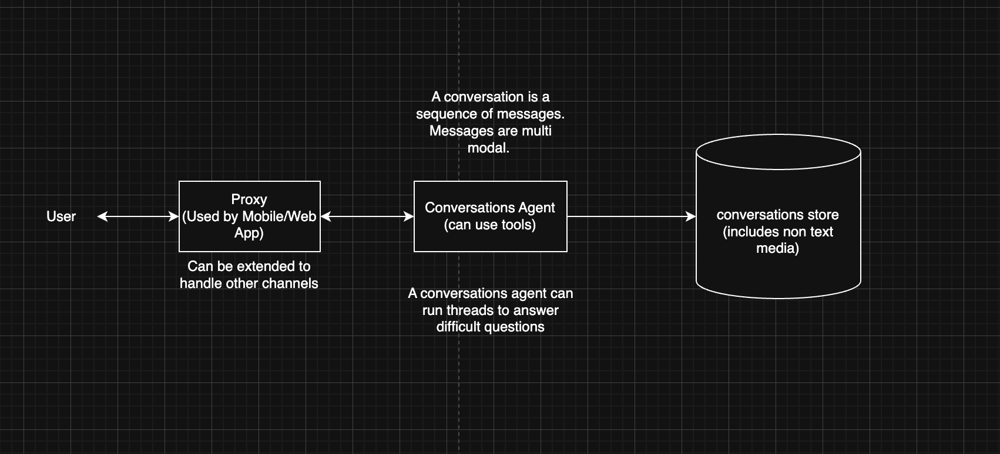

# Architecture

## Overview

A conversation is a sequence of messages. Messages are multi-modal.



## Components

**Message Proxy** — Entry point for the Mobile and Web apps. Can be
extended to handle other channels.

**Conversations Agent** — The primary agent. Handles user messages, can use
tools, and writes to the Conversations Store. Can run threads to answer
difficult questions.

**Conversations Store** — Persists conversation history including non-text
media (images, audio, documents).

**Background Knowledge Curation Agent** — Runs asynchronously, triggered
via tool calls from the Conversations Agent or on a scheduler. Reads from
the Conversations Store, processes content, and writes to the Curated
Knowledge Store.

**Curated Knowledge Store** — Vector store + causal graph. The indexed,
curated knowledge base used for retrieval.

## Package Structure

```
packages/
  agents/                    # Conversations + knowledge curation agents
  domain/
    entities/                # Shared domain entities
    contracts/               # Shared domain contracts
  message-proxy/             # HTTP API, WebSocket, proxy layer
  web/                       # React dashboard
  mobile/                    # React Native app
```

## Design Decisions

**Agents are LLM loops with tools.** Each agent takes a message + context,
calls an LLM in a loop with a tool registry, and returns a response. Uses
the Vercel AI SDK's tool-use pattern — no heavy framework.

**Conversations Agent can spawn threads.** For difficult questions, the
agent can run sub-threads to break down and answer complex queries.

**Knowledge curation is async.** The Background Knowledge Curation Agent is
triggered via tool calls from the Conversations Agent or on a scheduler. It
reads from the Conversations Store, chunks content, embeds it, and writes
to the Curated Knowledge Store. Uses BullMQ + Redis or a cron polling a
table.

**Single Postgres instance to start.** `pgvector` for embeddings, regular
tables for the causal graph (nodes + edges with metadata). Can swap in
Neo4j for the graph later if queries get complex.

**Conversations Store holds all media.** Non-text media is stored alongside
conversation history rather than in a separate blob store.

**Browser automation lives in the tool registry.** Playwright as a tool
agents can invoke. Not a separate service.

## Tech Stack

| Concern | Choice | Rationale |
|---|---|---|
| LLM layer | Vercel AI SDK (`ai`) | Model-agnostic, TypeScript-first, no platform dependency |
| LLM providers | Anthropic / OpenAI / Ollama / Gemini | Swappable via AI SDK providers |
| RAG / indexing | LlamaIndex TypeScript | Strong document ingestion, chunking, retrieval |
| Vector store | Postgres + pgvector | One database, no extra infra |
| Causal graphs | Postgres tables (start) → Neo4j (if needed) | Nodes + edges + metadata |
| Queue | BullMQ + Redis | Async ingestion jobs |
| Browser automation | Playwright | Headless, Bun/Node compatible |

## Build Order

1. **`packages/agents`** — Conversations and knowledge curation agent workflows
2. **`packages/message-proxy`** — `/chat` endpoint, proxy layer, conversations store
3. **Add channels** — web app first (already scaffolded), extend proxy for other channels as needed

## Notes

- The Vercel AI SDK is a standalone open-source package (`npm install ai`).
  It has no dependency on Vercel's hosting platform.
- LangChain was considered and rejected: heavy abstraction layer, frequent
  breaking changes, painful to debug for custom behavior.
- LlamaIndex TS and the Vercel AI SDK are complementary — AI SDK handles
  the agent/LLM loop, LlamaIndex handles the knowledge pipeline.
