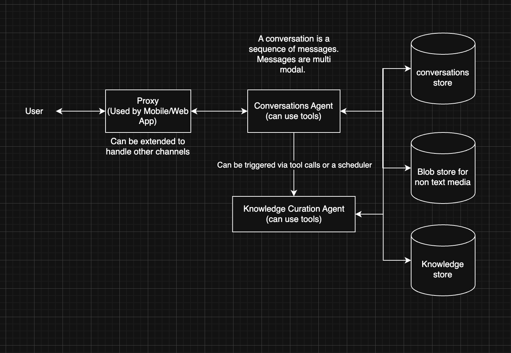

# Architecture

## Overview

A conversation is a sequence of messages. Messages are multi-modal.



## Components

**Proxy** — Entry point for the Mobile and Web apps. Can be extended to
handle other channels.

**Conversations Agent** — The primary agent. Handles user messages, can use
tools, and writes to the Conversations Store and Blob Store. Triggers the
Knowledge Curation Agent via tool calls or a scheduler.

**Knowledge Curation Agent** — Runs asynchronously. Reads from the
Conversations Store and Blob Store, processes content, and writes to the
Knowledge Store.

**Conversations Store** — Persists conversation history.

**Blob Store** — Stores non-text media (images, audio, documents).

**Knowledge Store** — Vector store + causal graph. The indexed, curated
knowledge base used for retrieval.

## Package Structure

```
packages/
  server/      # HTTP API, WebSocket, proxy layer
  agents/      # Conversations Agent, Knowledge Curation Agent, tool registry
  knowledge/   # Embeddings, vector search, causal graph CRUD
  channels/    # Proxy + future channel adapters
  web/         # React dashboard
  mobile/      # React Native app
  shared/      # Types, schemas, constants
```

## Design Decisions

**Agents are LLM loops with tools.** Each agent takes a message + context,
calls an LLM in a loop with a tool registry, and returns a response. Uses
the Vercel AI SDK's tool-use pattern — no heavy framework.

**Knowledge curation is async.** The Knowledge Curation Agent is triggered
via tool calls from the Conversations Agent or on a scheduler. It picks up
conversations and media, chunks them, embeds them, and writes to the
knowledge store. Uses BullMQ + Redis or a cron polling a table.

**Single Postgres instance to start.** `pgvector` for embeddings, regular
tables for the causal graph (nodes + edges with metadata). Can swap in
Neo4j for the graph later if queries get complex.

**Blob store for non-text media.** Binary content (images, audio, files) is
kept separate from the conversation and knowledge stores.

**Browser automation lives in the tool registry.** Playwright as a tool
agents can invoke. Not a separate service.

## Tech Stack

| Concern | Choice | Rationale |
|---|---|---|
| LLM layer | Vercel AI SDK (`ai`) | Model-agnostic, TypeScript-first, no platform dependency |
| LLM providers | Anthropic / OpenAI / Ollama / Gemini | Swappable via AI SDK providers |
| RAG / indexing | LlamaIndex TypeScript | Strong document ingestion, chunking, retrieval |
| Vector store | Postgres + pgvector | One database, no extra infra |
| Causal graphs | Postgres tables (start) → Neo4j (if needed) | Nodes + edges + metadata |
| Queue | BullMQ + Redis | Async ingestion jobs |
| Browser automation | Playwright | Headless, Bun/Node compatible |

## Build Order

1. **`packages/agents`** — Conversations Agent with tool-use via Vercel AI SDK
2. **`packages/knowledge`** — pgvector ingestion + retrieval for a single document type
3. **Wire through `packages/server`** — `/chat` endpoint, proxy layer, conversations store
4. **Knowledge Curation Agent** — triggered from Conversations Agent via tool call or scheduler
5. **Add channels** — web app first (already scaffolded), extend proxy for other channels as needed

## Notes

- The Vercel AI SDK is a standalone open-source package (`npm install ai`).
  It has no dependency on Vercel's hosting platform.
- LangChain was considered and rejected: heavy abstraction layer, frequent
  breaking changes, painful to debug for custom behavior.
- LlamaIndex TS and the Vercel AI SDK are complementary — AI SDK handles
  the agent/LLM loop, LlamaIndex handles the knowledge pipeline.
